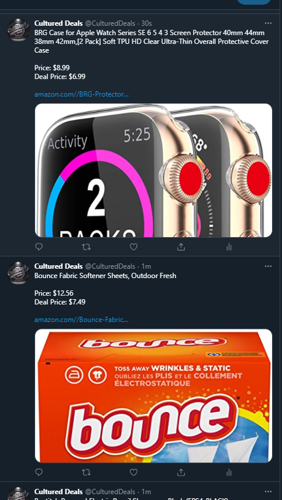

# AmazonPA-Data

Created by Sanjay Sewbhajan

Amazon CD Twitter Bot:

The bot was made for public use. The bot's main feature is tweet some of the best deals currently on Amazon. Using Google Cloud's mySQL database and Heroku deployment servers, the bot is able to grab and parse data from Amazon. The code is heavy Python and it populates the database with data from a headless chromium browser by using selenium. The database is constantly being updated and comparing prices. The tweeting python file is also constantly running and makes a post every 40 seconds to follow twitter's rate limits. 

**ACCOUNT SUSPENDED**
Bug in code that reposted the same deal multiple times in a row resulted in Twitter suspending account for breaking spam policy. Will be working new account and updating code to deal with this issue along with many more updates and rules. 
You can view the Twitter Account here: https://twitter.com/CulturedDeals

Next Steps:

+ [ ]  Priority Queue based on Ratings Given
+ [ ]  Shuffled Order (Easy Change)
+ [ ]  System to Mention User's for Specific Item's Price Change

Screenshot:

